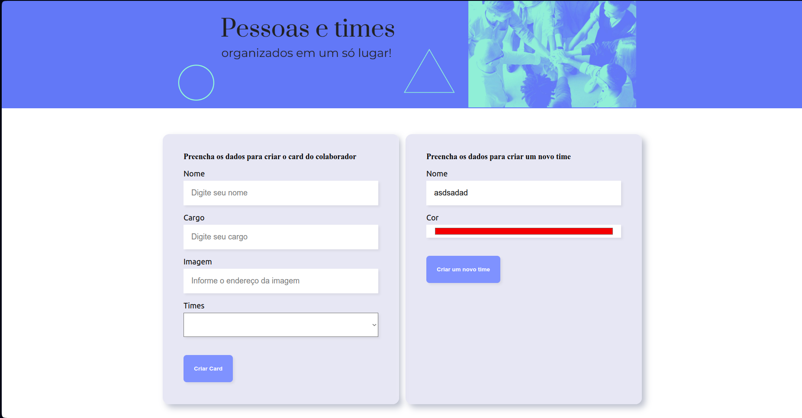
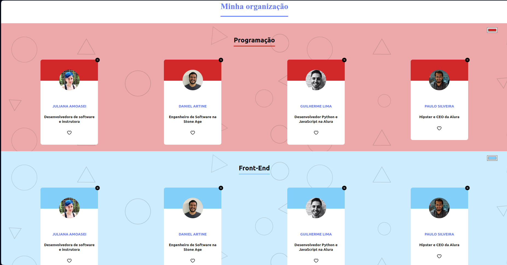

# Sistema Organo

O Sistema Organo foi desenvolvido como parte aula prática de React. O objetivo principal deste projeto é introduzir e praticar conceitos fundamentais de React, incluindo:

- Componentes estáticos e dinâmicos
- Props
- Desestruturação de componentes
- Refatoração
- Métodos de array como map e filter
- Criação de objetos para representar times e cores de times
- Implementação do MockAPI utilizando json-server para simular dados da API.
- Adição de useEffect e os métodos `GET`, `DELETE` e `PATCH`

O projeto foi inicialmente criado utilizando o Create React App e posteriormente migrado para o Vite.

## :dizzy: Tecnologias utilizadas

<div>
  
  
  
</div>

## :hammer: Funcionalidades

O Sistema Organo oferece diversas funcionalidades, incluindo:

- Cadastro de Pessoas: Permite o registro de nome, cargo e time de cada pessoa.
- Cadastro de Novos Times: Usuários podem criar novos times diretamente pela interface.
- Alteração de Cores dos Times: Função para personalizar a cor de cada time.
- Seleção de Times: Times são escolhidos a partir de uma lista de opções (select) que abrange várias áreas de atuação na programação, como Front-end, UX, Gestão, entre outras.
- Deletar Cards: Permite a exclusão de cards cadastrados diretamente do mockAPI.
- Favoritar Cards: Altenar o status favorito dos colaboradores no mockAPI.

Ao cadastrar um novo cartão (card) e escolher um time, o sistema utiliza o método filter para organizar e exibir os membros conforme suas áreas de atuação.

### Interface da página de cadastro: 


<br />

### Interface dos cards cadastrados:



<br />

## :globe_with_meridians: Como Acessar o Deploy Online

### Vercel

O projeto está disponível na Vercel. Você pode acessá-lo através do seguinte link: 

[Sistema Organo na Vercel.](https://organo.vercel.app/)

## Acesso às Versões

### [v1.0] - 21-06-2024

- [Projeto Inicial v1.0](https://github.com/charlesbrcosta/Organo/releases/tag/v1.0)

Esta versão do Sistema Organo inclui a implementação inicial dos seguintes conceitos e funcionalidades.

### Adicionado:

- Componentes estáticos e dinâmicos
- Props
- Métodos de array (map e filter)
- Criação de objetos para representar times

### [v2.0] - 25-06-2024

- [Versão Atualizada v2.0](https://github.com/charlesbrcosta/Organo/releases/tag/v2.0)

Esta versão inclui várias melhorias e novas funcionalidades para o Sistema Organo.

### Adicionado:

- Desestruturação de Props
- Refatoração de componentes
- Adição de biblioteca react-icons
- Adição do objeto initial que renderiza cards
- Funcionalidade para alteração de cores
- Funcionalidade para criar novos times e cores

### [v3.0] - 26-06-204

- [Migração para Vite v3.0](https://github.com/charlesbrcosta/Organo/releases/tag/v3.0)

Esta versão inclui algumas mudanças na estrutura do projeto do sistema.

### Mudado:

- Migração do projeto de create-react-app para Vite
- Adição de configurações no package.json:
- Definição de tipo module, inclusão de dependências e scripts
- Ajuste no arquivo index.html
- Atualização das extensões de .js para .jsx
- Renomeação de index.js para main.jsx


### [v3.1.0] - 28-06-2024

- [Adição do MockAPI v3.1.0](https://github.com/charlesbrcosta/Organo/releases/tag/v3.1.0)

Esta versão inclui a implementação de uma API simulada para o Back-End e novas funcionalidades.

### Adicionado:

- Implementação MockAPI utilizando json-server para simular dados API.
- Funcionalidade para excluir colaboradores diretamente do mockAPI.
- Funcionalidade para alternar o status favorito dos colaboradores no mockAPI.

### Mudado
- Documentação atualizada para incluir instruções do uso do json-server.

## :warning: Como Executar o Projeto Localmente

### Pré-requisitos

- Node.js instalado
- npm (gerenciador de pacotes do Node.js)
- Navegador web moderno que suporte HTML5, CSS3 e JavaScript.

## :dvd: Passo a Passo

1. Clone o repositório:

   ```bash
   git clone https://github.com/charlesbrcosta/Organo.git

2. Acesse o diretório do projeto:
    ```bash
    cd Organo

3. Instale as dependências:
    ```bash
    npm install ou npm i

4. Inicie o servidor mockAPI (json-server):
    ```bash
    npm run mock

5. Inicie o aplicativo organo:
    ```bash
    npm start ou npm run start

## :memo: Observação

Caso precise efetuar a instalação do json-server, execute o comando abaixo:
    
1. Instala o json-server globalmente:
    ```bash
    npm install -g json-server


## :handshake: Contribuição

Se você quiser contribuir com o projeto, siga os passos abaixo:

    Faça um fork deste repositório.
    Crie uma nova branch (git checkout -b feature/nova-feature).
    Faça commit das suas alterações (git commit -am 'Adiciona nova feature').
    Faça push para a branch (git push origin feature/nova-feature).
    Abra um Pull Request.

## :student: Autor

[<br><sub>Charles Bruno</sub>](https://github.com/charlesbrcosta)


## :page_facing_up: Licença

Este projeto está licenciado sob a [Licença MIT](https://www.mit.edu/~amini/LICENSE.md).
