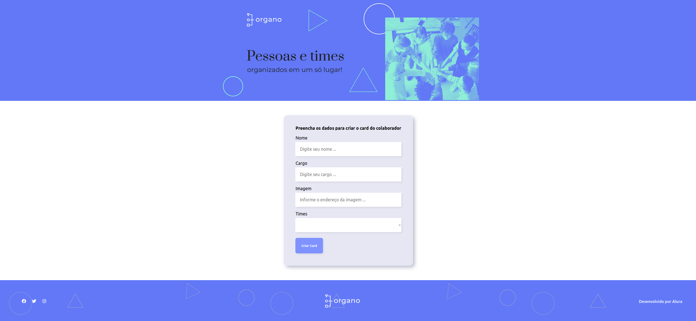
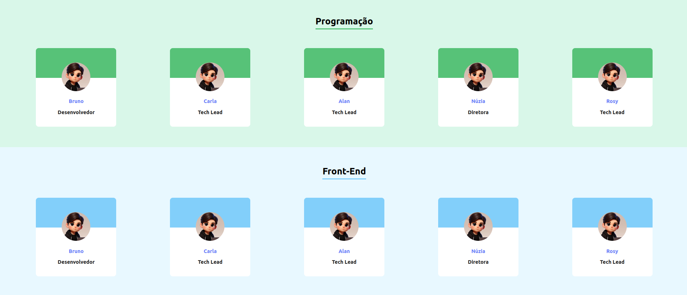

# Sistema Organo

O Sistema Organo foi desenvolvido como parte da primeira aula prática de React. O objetivo principal deste projeto é introduzir e praticar conceitos fundamentais de React, incluindo:

- Componentes estáticos e dinâmicos
- Props
- Desestruturação de componentes
- Refatoração
- Métodos de array como map e filter
- Criação de objetos para representar times e cores de times
- Criação de objeto para adicionar icons de redes sociais

O projeto foi iniciado utilizando o create-react-app.

## :dizzy: Tecnologias utilizadas

<div>
  
  
  
</div>

## :hammer: Funcionalidades

O Sistema Organo permite o cadastro de pessoas, incluindo nome, cargo e time. Os times são selecionados a partir de uma lista de opções (select), que inclui áreas de atuação na programação, como Front-end, UX, Gestão, entre outras.

Ao cadastrar um novo cartão (card) e escolher um time, o sistema utiliza o método filter para organizar e exibir os membros conforme suas áreas de atuação.

### Interface da página inicial: 


<br />

### Interface do cadastro de pessoas:



<br />

## :globe_with_meridians: Como Acessar o Deploy Online

### Vercel

O projeto está disponível na Vercel. Você pode acessá-lo através do seguinte link: 

[Sistema Organo na Vercel.](https://organo.vercel.app/)

## :warning: Como Executar o Projeto Localmente

### Pré-requisitos

- Node.js instalado
- npm (gerenciador de pacotes do Node.js)
- Navegador web moderno que suporte HTML5, CSS3 e JavaScript.

## :dvd: Passo a Passo

1. Clone o repositório:

   ```bash
   git clone https://github.com/charlesbrcosta/Organo.git

2. Acesse o diretório do projeto:
    ```bash
    cd Organo

3. Instale as dependências:
    ```bash
    npm install ou npm i

4. Inicie o sistema organo:
    ```bash
    npm start

## :handshake: Contribuição

Se você quiser contribuir com o projeto, siga os passos abaixo:

    Faça um fork deste repositório.
    Crie uma nova branch (git checkout -b feature/nova-feature).
    Faça commit das suas alterações (git commit -am 'Adiciona nova feature').
    Faça push para a branch (git push origin feature/nova-feature).
    Abra um Pull Request.

## :student: Autor

[<br><sub>Charles Bruno</sub>](https://github.com/charlesbrcosta)


## :page_facing_up: Licença

Este projeto está licenciado sob a [Licença MIT](https://www.mit.edu/~amini/LICENSE.md).
